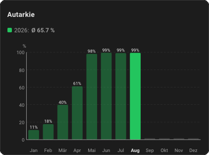
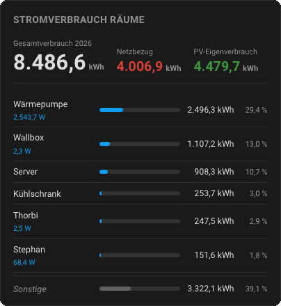
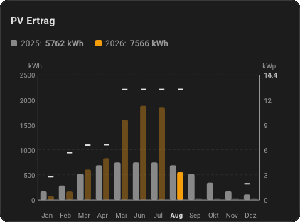
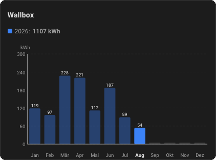
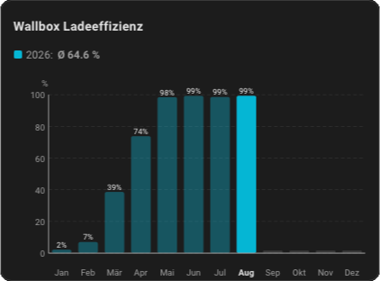
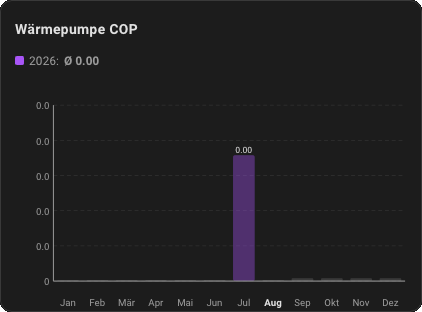
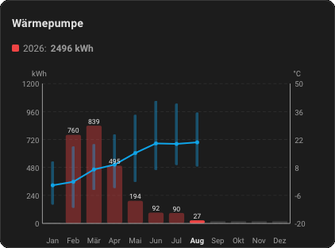
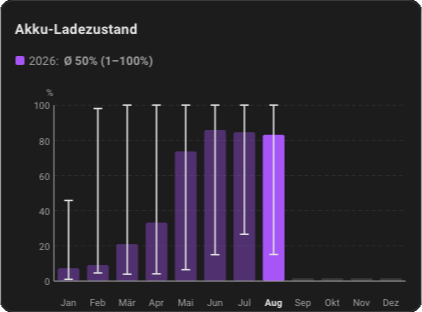
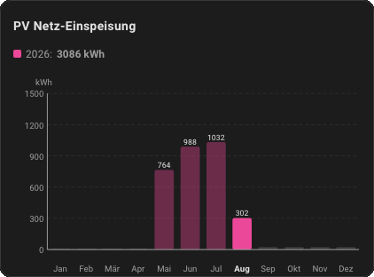
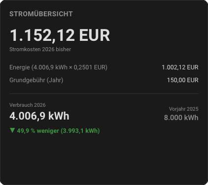

# Energy Card by Lutarym

Lovelace Custom Card for Home Assistant. A single card whose behaviour is
chosen via `card_type` in a visual configuration form. Most types draw
monthly bar charts (current year vs. up to 3 previous years); a few draw a
computed ratio (efficiency, self-consumption, COP), and two render a
text/number summary instead of bars (electricity overview, per-room
energy). The editor and the card itself are fully bilingual
(German/English), following `hass.language` automatically.

## Card types

There are 13 `card_type` presets. Each screenshot below shows the preset
with its default styling; every colour, title and entity can be overridden
in the editor.

### autarkie — Self-Sufficiency



Monthly average of a self-sufficiency percentage sensor. Y-axis fixed
0–100 %. Summary value is the yearly average (not a sum).
Default entity: `sensor.autarkie`.

### energy — Power Consumption



Monthly consumption in kWh (monthly sum). Auto-scaled Y-axis.
Default entity: `sensor.stromverbrauch`.

### pv — PV Yield



Monthly PV yield in kWh (monthly sum). Two optional overlays:

- `kwp`: installed capacity. Draws a dashed reference line against its own
  right-hand kW scale.
- `power_entity`: an instantaneous power sensor (kW/W, `state_class:
  measurement`, e.g. the inverter's AC power). Shows the monthly peak as a
  short tick on top of each bar, on the same right-hand kW axis. This must
  be a **separate** entity from the yield sensor: the yield sensor is a
  cumulative kWh counter (only a monthly `sum` is meaningful), while only an
  instantaneous power sensor has a meaningful monthly `max`.

Default entity: `sensor.pv_ertrag`.

### wallbox — Wallbox



Monthly wallbox charging energy in kWh (monthly sum). Optional overlay:

- `distance_entity`: an odometer or trip sensor. Draws a km-driven line on
  its own right-hand km scale (a monthly sum, like the charging energy
  itself, since distance driven has no meaningful sub-monthly range).

Default entity: `sensor.wallbox`.

### wallbox_eff — Wallbox Charging Efficiency



Share of wallbox charging that happened while no grid power was drawn.
Fixed 0–100 % bar chart per month. Requires two entities:

- `entity`: total wallbox charging energy (kWh).
- `grid_entity`: grid draw, given as **power** (W/kW) or **energy** (kWh).
  Power is integrated from recorded hourly means into monthly import kWh
  (import only).

Monthly value = (1 − grid_import_kWh ÷ total_kWh) × 100, clamped 0–100.
No grid draw in a month means 100 %.

### eigenverbrauch — Self-Consumption


Share of PV generation used at home instead of exported. Fixed 0–100 % bar
chart per month. Requires two entities:

- `entity`: PV yield (kWh).
- `feedin_entity`: grid feed-in / export (kWh).

Monthly value = (PV − feed-in) ÷ PV × 100. Both values are directly
metered, so a plain monthly ratio is exact.

### cop — Heat Pump COP



Heat produced per unit of electricity. Auto-scaled axis; the value is a
number (typically ~2–5), not a percentage, shown with 2 decimals.
Requires two entities:

- `entity`: electrical energy consumed (kWh).
- `heat_entity`: thermal energy produced (kWh, e.g. from HeishaMon).

Monthly value = heat ÷ electricity. Needs a real thermal-energy sensor to
be meaningful.

### wp — Heat Pump



Monthly heat-pump energy in kWh (monthly sum). Optional overlay:

- `temperature_entity`: an outdoor-temperature sensor. Draws a temperature
  line on its own right-hand °C scale (this axis has a real min **and** max,
  since winter months go negative). Resolution via `temp_mode`:
  - `daily` (default): one point per calendar day, matching Home
    Assistant's own history graph. Auto-simplifies to a monthly min/max
    band below ~500px card width, then to a plain monthly average line below
    ~280px, computed from the same daily data with no extra request.
  - `minmax`: a monthly min/max band plus a mean line, always.
  - `mean`: a plain monthly average line, always.

Default entity: `sensor.waermepumpe`.

### klima — Air Conditioning


Monthly air-conditioning energy in kWh (monthly sum). Supports the same
optional `temperature_entity` / `temp_mode` overlay as `wp` (more AC use
tends to track hotter months).
Default entity: `sensor.klimaanlage`.

### akku — Battery State of Charge



Monthly battery state of charge. Y-axis fixed 0–100 %. The bar is always
anchored at 0 (height = monthly mean, like every other preset). `stat_mode`
selects the display:

- `mean` (default): plain monthly average.
- `minmax`: the monthly min/max is overlaid as a whisker (a vertical line
  with caps, on the same scale as the bar). No separate number label in
  this mode; the exact Ø/min/max figures are in the summary line above the
  chart.

Default entity: `sensor.akku_ladezustand`.

### einspeisung — Grid Feed-in



Monthly grid feed-in / export in kWh (monthly sum). This preset has **no
default entity**: a guessed sensor name would never match a real setup, so
the card shows a short "select an entity" hint until one is configured.

### overview — Electricity Overview



Not a bar chart. A text/number summary of electricity cost and consumption
for the current year so far, with an optional previous-year comparison.
Configuration:

- `energy_entity`: energy sensor (kWh). **Required.**
- `price_per_kwh`: price per kWh in EUR (e.g. `0.32` for 32 ct/kWh).
  **Required.**
- `base_fee_yearly` or `base_fee_monthly`: base fee (use one of the two).
- `base_fee_mode`: `accrued` (default, prorated to the elapsed part of the
  year) or `full` (the full amount).
- `currency`: default `EUR`.
- `previous_year_kwh`: optional manual override. Auto-calculated from
  statistics (previous Jan 1 to Dec 31); only set this if historical data
  is missing.

### rooms — Room Energy Consumption


Not a bar chart. Per-room yearly kWh with each room's percentage share of
the house total. Configuration:

- `total_entity`: total energy / grid-import meter (optional, e.g. OBIS
  1.8.0). Leave empty for a rooms-only view (share of the rooms' sum, no
  "Other" row).
- `pv_entity`: PV yield (optional, kWh).
- `feedin_entity`: grid feed-in (optional, kWh). With `pv_entity` and
  `feedin_entity` both set, real consumption = grid import + (PV yield −
  feed-in), so the "Other" row and the shares reflect true usage including
  PV self-consumption.
- `rooms`: up to 10 rooms, each with a freely chosen `name`, its own energy
  `entity`, and an optional live `power_entity`.

## Installation via HACS

1. HACS → Frontend → **⋮** → Custom repositories
2. Enter this repository's URL, category **Dashboard**
3. Install "Energy Card by Lutarym"
4. Reload Home Assistant (clear browser cache if needed)

## Manual installation

Copy `lutarym-energy-card.js` to `config/www/`:

```yaml
resources:
  - url: /local/lutarym-energy-card.js
    type: module
```

## Usage

Add via **Edit Dashboard → Add Card → "Energy Card by Lutarym"**. This
opens the visual configuration form directly, which is the recommended way
to configure every option below.

```yaml
type: custom:lutarym-energy-card
card_type: pv            # autarkie | energy | pv | wallbox | wallbox_eff | eigenverbrauch | cop | wp | klima | akku | einspeisung | overview | rooms
years_back: 2             # optional: 0 | 1 | 2 | 3 additional previous years (default: 1); bar presets only
show_values: true         # optional: the number above each bar (not the axis scale), default: true; bar presets
show_legend: false        # optional: small year swatches inside the chart, default: false
y_max: null               # optional: fixed top value for the Y-axis (leave empty for automatic)
y_headroom: 20            # optional: extra % space above the highest bar in automatic mode (default: 20)

# --- akku only ---
stat_mode: mean           # mean | minmax (bar stays at 0, min/max as a whisker, no separate axis)

# --- pv only ---
kwp: 14.4                 # installed capacity: dashed reference line vs. a right-hand kW scale
power_entity: sensor.xyz  # instantaneous power sensor: monthly peak as a tick per bar

# --- wp / klima only ---
temperature_entity: sensor.aussentemperatur # outdoor temp: temperature line
temp_mode: daily          # daily | minmax | mean (default: daily)
color_temp: "#0ea5e9"    # temperature line color (default: sky blue)

# --- wallbox only ---
distance_entity: sensor.auto_odometer # odometer/trip sensor: km-driven line
color_distance: "#84cc16" # distance line color (default: lime green)

# --- wallbox_eff only ---
grid_entity: sensor.grid_power   # required: grid draw (power W/kW or energy kWh)

# --- eigenverbrauch only ---
feedin_entity: sensor.pv_feedin  # required: grid feed-in (kWh)

# --- cop only ---
heat_entity: sensor.heat_produced # required: thermal energy produced (kWh)

# --- overview only ---
energy_entity: sensor.stromverbrauch # required
price_per_kwh: 0.32       # required (EUR per kWh)
base_fee_yearly: 120      # or base_fee_monthly: 10
base_fee_mode: accrued    # accrued (prorated) | full
currency: EUR
previous_year_kwh: 4200   # optional manual override

# --- rooms only ---
total_entity: sensor.grid_import  # optional
pv_entity: sensor.pv_ertrag       # optional
# feedin_entity: sensor.pv_feedin # optional (see rooms section)
rooms:
  - name: Living Room
    entity: sensor.room_living
    power_entity: sensor.room_living_power  # optional
  - name: Office
    entity: sensor.room_office

# --- appearance (all types) ---
color: "#f59e0b"         # main color for the current year
color_prev: "#888888"    # color for the immediate previous year
color_text: "#1c1c1c"    # text/value color (default: follows theme)
color_dim: "#f59e0b55"   # muted color (past months, current year)
appearance: auto          # auto | light | dark
title: "My title"         # optional: overrides the preset title
title_font_size: 14       # optional, default 14px
label_font_size: 10       # optional, default: automatic
```

Hovering a bar with the mouse shows a small tooltip with month, year, and
the exact value (Ø with min/max range in the akku min/max mode; peak-power
ticks on the pv preset show their own value too).

### Presets overview

| card_type | Default entity | Title | Color | Extra required entity |
|---|---|---|---|---|
| autarkie | sensor.autarkie | Self-Sufficiency | `#22c55e` | — |
| energy | sensor.stromverbrauch | Power Consumption | `#00b4d8` | — |
| pv | sensor.pv_ertrag | PV Yield | `#f59e0b` | — |
| wallbox | sensor.wallbox | Wallbox | `#3b82f6` | — |
| wallbox_eff | *(none)* | Wallbox Charging Efficiency | `#06b6d4` | `grid_entity` |
| eigenverbrauch | *(none)* | Self-Consumption | `#f59e0b` | `feedin_entity` |
| cop | *(none)* | Heat Pump COP | `#a855f7` | `heat_entity` |
| wp | sensor.waermepumpe | Heat Pump | `#ef4444` | — |
| klima | sensor.klimaanlage | Air Conditioning | `#06b6d4` | — |
| akku | sensor.akku_ladezustand | Battery State of Charge | `#a855f7` | — |
| einspeisung | *(none)* | Grid Feed-in | `#ec4899` | — |
| overview | *(none)* | Electricity Overview | `#0ea5e9` | `energy_entity`, `price_per_kwh` |
| rooms | *(none)* | Room Energy Consumption | `#03a9f4` | `rooms` list |

The default entities are placeholders; enter your actual entity ID in the
editor. Presets marked *(none)* have no default at all and show a short
"select an entity" hint until configured.

## License

Private / personal use.
